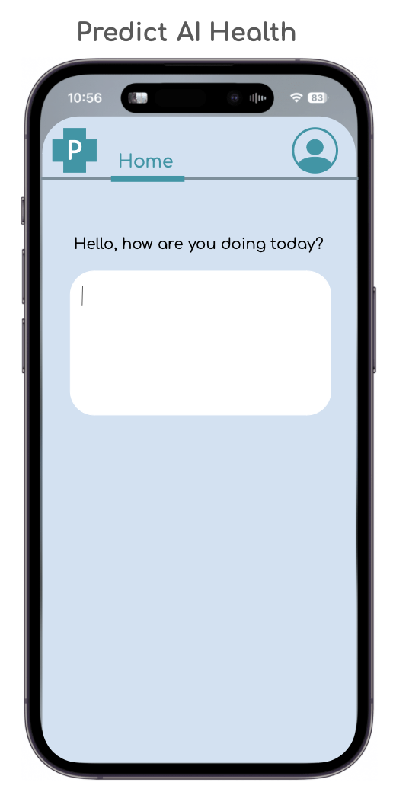

# Predict AI Health App  
### *An intelligent health journaling companion for personalized, predictive wellness.*

#### neuroncdocs team
#### Cristy Bañuelos, Harish Bayana, Maren Cukor, Zain Hussain, Taelor Matos 

---

## Overview  
**Predict AI** is a health-focused AI app designed to empower users to better understand their bodies, habits, and symptom patterns through a conversational interface and predictive modeling.  

Users interact with the app by responding to a simple, friendly prompt like:  
> “Hello, how are you feeling today?”  

They can freely journal about their **symptoms, mood, diet, triggers, sleep**, or anything relevant to their day.  

The app automatically integrates this text data with **real-world contextual features** — such as **weather**, **time**, **date**, and optionally **wearable data** (e.g., heart rate, steps, sleep quality) — to create a holistic snapshot of each day’s health state.  

  

---

## Conversational LLM Component  
At the core of Predict AI’s interface is a **Large Language Model (LLM)** that acts as a **compassionate health companion**.  

### What it does:
- **Understands free-text journal entries** about symptoms, emotions, and behaviors.  
- **Extracts key features** (e.g., symptom mentions, severity, mood tone, triggers, diet patterns) using natural language understanding.  
- **Provides feedback** such as summaries, health insights, and encouraging messages.  
- **Contextualizes** user input with external signals (weather, time, past patterns).  
- **Optionally connects** to a social component for positive peer interaction, progress sharing, and motivation.  

### Future features:
- Chat-based health assistant using **retrieval-augmented generation (RAG)** for condition-specific insights.  
- Integration with medical knowledge bases for **evidence-informed suggestions**.  
- Personalized journaling prompts based on recent data trends (e.g., “I noticed you’ve been sleeping less — how are you feeling today?”).  

---

## Predictive Modeling Component  

While the LLM powers the front-end user experience, the back-end engine uses **predictive machine learning** to identify **emerging health risks** or **symptom patterns**.  

We leverage structured data from the Flaredown Chronic Illness dataset and future user logs from the Predict AI app to train models that can **forecast symptom or condition onset**.

---

### Inputs
| Variable | Description | Notes |
|-----------|-------------|-------|
| `user_id` | Unique user identifier | Used to group longitudinal data |
| `age` | User’s age | Outliers clipped (0–110); missing values imputed |
| `sex` | Biological sex | Normalized to `male`, `female`, or `unknown` |
| `country` | Country of residence | Missing values replaced with `unknown` |
| `checkin_date` | Date of user check-in | Converted to datetime |
| `trackable_type` | Type of event being tracked | Condition, Symptom, Food, Tag, Treatment, Weather, etc. |
| `trackable_name` | Name of tracked item | e.g., “headache”, “coffee”, “stress” |
| `trackable_value` | Numeric severity or quantity | e.g., symptom severity (0–4) |

---

### Feature Engineering
Each `trackable_type` is mapped to a domain-specific keyword group:

| Type | Feature Groups |
|------|----------------|
| **Condition** | `condition_keyword_groups` (psychiatric, autoimmune, neurological, pain, etc.) |
| **Symptom** | `symptom_keyword_groups` (pain, fatigue, cognitive, stress, etc.) |
| **Food** | `food_keyword_groups` (vegetables, meats, processed foods, caffeine, etc.) |
| **Tag** | `tag_keyword_groups` (stress, sleep, menstrual, environment, etc.) |
| **Treatment** | `treatment_keyword_groups` (NSAIDs, SSRIs, biologics, etc.) |
| **Weather** | Temperature, humidity, pressure, precipitation, etc. |

Daily data is aggregated per user and enhanced with **rolling window features** (7-day, 30-day averages and sums) to model recent health trends.

---

### Outputs

| Target | Description |
|---------|--------------|
| **Conditions** | Predicts incidence of chronic or psychiatric conditions (e.g., Depression, Anxiety, Rheumatoid Arthritis, POTS)
| **Symptoms** | Predicts incidence of next day symptoms that underlie chronic or psychiatric conditions 
