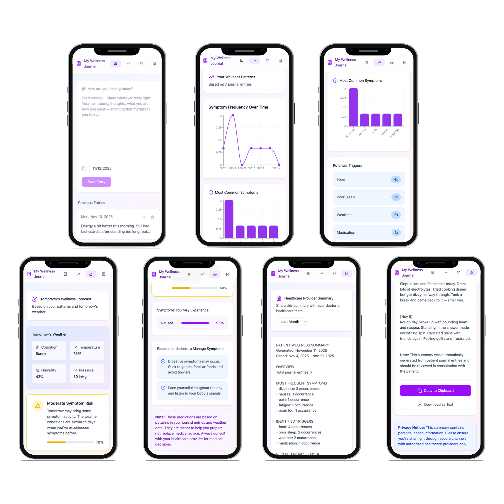

# My Wellness Journal  
### *An intelligent, patient-centered health journaling app for personalized, predictive wellness.*

**MD+ Datathon Neurondocs Team**  
Cristy Bañuelos, Harish Bayana, Maren Cukor, Zain Hussain, Taelor Matos  

---

## Overview  
**My Wellness Journal** is an AI-powered health journaling app that empowers patients to understand and manage their chronic conditions through intuitive self-tracking and predictive modeling.  

Instead of asking users to label entries as “conditions,” “symptoms,” or “tags,” the app invites them to simply describe their experience in their own words.  
> “How are you feeling today?”  

From this free-text journaling, AI models interpret language to identify symptoms, mood, and contextual factors, building a holistic picture of each user’s health over time.  

  

---

## Core Features  

### Intelligent Journaling  
- Users freely write about their daily experiences with illness, symptoms, and emotions.  
- AI interprets these entries—extracting relevant features such as **symptom mentions**, **severity**, **mood tone**, and **potential triggers**.  
- Removes the burden of medical classification and captures authentic patient language.  

### Real-Time Predictive Modeling  
- Built on insights from the **Flaredown Chronic Illness dataset** and user journaling data.  
- Models identify emerging symptom patterns, predict flare-ups, and suggest personalized management strategies.  
- The predictive engine continuously learns from user feedback and evolving data.  

### App Interface (Prototype)  
Our prototype demonstrates how predictive models can operate directly on a patient’s personal device ([Figma Inc., 2025](https://www.figma.com)).  

The interface includes:  
- A **single, intuitive input field** for journaling by date.  
- **Symptom frequency visualizations** over time. 
- **Personalized predictions and recommendations** for symptom management.  
- An **exportable summary** for healthcare providers.  

This design empowers patients without overwhelming them with clinical jargon or introducing mislabeled variables into predictive models.  
It bridges communication between patients, predictive analytics, and healthcare professionals to support **personalized daily care**.  

--- 

## Predictive Modeling Component 

While the LLM powers the front-end user experience, the back-end engine uses **predictive machine learning** to identify **emerging health risks** or **symptom patterns**. 

We leverage structured data from the Flaredown Chronic Illness dataset and future user logs from the Predict AI app to train models that can **forecast symptom or condition onset**.

--- 

### Inputs 
| Variable | Description | Notes | 
|-----------|-------------|-------| 
| user_id | Unique user identifier | Used to group longitudinal data |
| age | User’s age | Outliers clipped (0–110); missing values imputed | 
| sex | Biological sex | Normalized to male, female, or unknown | 
| country | Country of residence | Missing values replaced with unknown | 
| checkin_date | Date of user check-in | Converted to datetime | 
| trackable_type | Type of event being tracked | Condition, Symptom, Food, Tag, Treatment, Weather, etc. | 
| trackable_name | Name of tracked item | e.g., “headache”, “coffee”, “stress” | 
| trackable_value | Numeric severity or quantity | e.g., symptom severity (0–4) | 

--- 

### Feature Engineering 
Each trackable_type is mapped to a domain-specific keyword group: 
| Type | Feature Groups | 
|------|----------------| 
| **Condition** | condition_keyword_groups (psychiatric, autoimmune, neurological, pain, etc.) | 
| **Symptom** | symptom_keyword_groups (pain, fatigue, cognitive, stress, etc.) | 
| **Food** | food_keyword_groups (vegetables, meats, processed foods, caffeine, etc.) | 
| **Tag** | tag_keyword_groups (stress, sleep, menstrual, environment, etc.) | 
| **Treatment** | treatment_keyword_groups (NSAIDs, SSRIs, biologics, etc.) |
| **Weather** | Temperature, humidity, pressure, precipitation, etc. | 

Daily data is aggregated per user and enhanced with **rolling window features** (7-day, 30-day averages and sums) to model recent health trends. 

--- 

### Outputs 

| Target | Description | 
|---------|--------------| 
| **Conditions** | Predicts incidence of chronic or psychiatric conditions (e.g., Depression, Anxiety, Rheumatoid Arthritis, POTS) | **Symptoms** | Predicts incidence of next day symptoms that underlie chronic or psychiatric conditions
---
